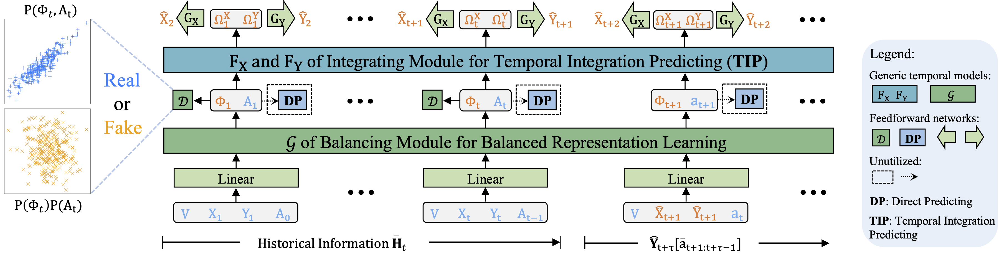

# Adversarial Counterfactual Temporal Inference Network (ACTIN)

## Project Description



The Adversarial Counterfactual Temporal Inference Network (ACTIN) introduces a targeted approach to the domain of counterfactual estimation over time, which is essential for refining and optimizing treatment strategies in various contexts. ACTIN is a novel framework that consists of two primary modules, each contributing to the improved accuracy of counterfactual estimations:

- **Balancing Module**: This component adopts a distinctive distribution-based methodology for learning balanced representations. This innovative approach moves beyond traditional classification-based methods, effectively addressing confounding bias and demonstrating adaptability to scenarios beyond categorical treatments.
- **Integrating Module with Temporal Integration Predicting (TIP) Strategy**: Diverging from the conventional Direct Predicting (DP) techniques that depend mainly on balanced representations and current treatments, this module synthesizes these elements with their historical data at each temporal stage, enabling a more nuanced analysis. The TIP strategy notably enhances the model's ability to understand and incorporate long-term dependencies and temporal treatment interactions.

Further details on installation, configuration, and utilization of ACTIN to fully leverage its capabilities for your counterfactual estimation tasks will be provided in the subsequent sections.

## Installation Guide

### Setting Up the Virtual Environment
We recommend using a `conda` virtual environment for a cleaner and more controlled development environment. If you haven't already installed Anaconda or Miniconda, you can do so by following the instructions on [Anaconda's website](https://www.anaconda.com/products/distribution) or [Miniconda's website](https://docs.conda.io/en/latest/miniconda.html). After installation, create and activate a new conda environment with the following commands:

```bash
conda create -n myenv python=3.8
conda activate myenv
```

### Installing Dependencies
The project is primarily built using the following Python libraries

1. [Pytorch-Lightning](https://pytorch-lightning.readthedocs.io/en/latest/) - deep learning models
2. [Hydra](https://hydra.cc/docs/intro/) - simplified command line arguments management

Once your virtual environment is set up and activated, you can install all the required dependencies for ACTIN. These dependencies are listed in the `requirements.txt` file within your project directory. Navigate to your project directory and install the dependencies using the following commands:

```bash
cd path/to/your/project
pip install -r requirements.txt
```

With these steps, your environment should be correctly set up and ready to use.

## Datasets

To run experiments, you need to specify a dataset or dataset generator, along with any additional required parameters. 

- For the Synthetic Tumor Growth Simulator:
  ```bash
  # Single sliding treatment
  +dataset=cancer_sim
  # Random trajectories
  +dataset=cancer_sim_random
  ```

- For the MIMIC III Semi-synthetic Simulator (with multiple treatments and outcomes):

  ```bash
  +dataset=mimic3_synthetic
  ```

- For the MIMIC III Real-world dataset:

  ```bash
  +dataset=mimic3_real
  ```

- For the continuous intervention synthetic dataset:

  ```bash
  +dataset=ci_sim
  ```

Please note that before running experiments with the MIMIC III datasets, you should place the MIMIC-III-extract dataset ([all_hourly_data.h5](https://github.com/MLforHealth/MIMIC_Extract)) in the `data/processed/` directory of your project. 

## Experiments

- For the Synthetic Tumor Growth Simulator: 

  ```bash
  # Reproducing the experimental results of the default ACTIN (TCN-based) at gamma=${gamma} with seed=${seed}
  python runnables/train.py +dataset=cancer_sim +backbone=cancer +backbone/hparams/cancer=${gamma} exp.seed=${seed} exp.logging=False
  # Reproducing the experimental results of the LSTM-based ACTIN at gamma=${gamma} with seed=${seed}
  python runnables/train.py +dataset=cancer_sim +backbone=cancer_lstm +backbone/hparams/cancer=${gamma}_lstm exp.seed=${seed} exp.logging=False
  ```

  ```bash
  # To reproduce the results of single sliding treatment mode, run
  ./train_cancer_single.sh ${gamma} # gamma is selected from {zero,one,two,three,four}
  # To reproduce the results of single sliding treatment mode for LSTM-based ACTIN, run
  ./train_lstm_cancer_single.sh ${gamma}
  # To reproduce the results of random trajectories mode, run
  ./train_cancer_random.sh ${gamma} # gamma is selected from {zero,one,two,three,four}
  # To reproduce the results of single sliding treatment mode for LSTM-based ACTIN, run
  ./train_lstm_cancer_random.sh ${gamma}
  ```

- For the MIMIC III Semi-synthetic Simulator (with multiple treatments and outcomes):

  ```bash
  # Reproducing the experimental results of the default ACTIN with seed=${seed}
  python runnables/train.py +dataset=mimic3_synthetic +backbone=mimic_synthetic +backbone/hparams=mimic_synthetic exp.seed=${seed} exp.logging=False
  # Reproducing the experimental results of the LSTM-based ACTIN with seed=${seed}
  python runnables/train.py +dataset=mimic3_synthetic +backbone=mimic_synthetic_lstm +backbone/hparams=mimic_synthetic_lstm exp.seed=${seed} exp.logging=False
  ```

  ```bash
  # To reproduce the results, run:
  ./train_sys.sh 
  # To reproduce the results for LSTM-based ACTIN, run:
  ./train_lstm_sys.sh 
  ```

- For the MIMIC III Real-world dataset:

  ```bash
  # Reproducing the experimental results of the default ACTIN with seed=${seed}
  python runnables/train.py +dataset=mimic3_real +backbone=mimic_real +backbone/hparams=mimic_real exp.seed=${seed} exp.logging=False
  # Reproducing the experimental results of the LSTM-based ACTIN with seed=${seed}
  python runnables/train.py +dataset=mimic3_real +backbone=mimic_real_lstm +backbone/hparams=mimic_real_lstm exp.seed=10 exp.logging=False
  ```

  ```bash
  # To reproduce the results, run:
  ./train_real.sh 
  # To reproduce the results for LSTM-based ACTIN, run:
  ./train_lstm_real.sh 
  ```

- For the continuous intervention synthetic dataset:

  ```bash
  # Reproducing the experimental results of the default ACTIN with seed=${seed}
  python runnables/train.py +dataset=ci_sim +backbone=ci_sim exp.seed=${seed} exp.logging=False
  ```

To reproducethe results of the **ablation** studies, please add the following to the aforementioned command line:

```bash
# w/o balancing
exp.lambda_D=0
# w/o integrating 
model.num_blocks=1
# with DP
model.recursive=False
```

To reproducethe the results of other baselines, please refer to the [CausalTransformer repository](https://github.com/Valentyn1997/CausalTransformer). Our approach for data generation closely follows the methodology described there, with minor modifications specific to ACTIN that do not alter the generation results. To ensure fairness in comparative experiments, we employed a consistent set of seeds [10,101,1010,10101,101010] across all baselines, in line with the practices in [CausalTransformer](https://proceedings.mlr.press/v162/melnychuk22a/melnychuk22a.pdf).

###Experimental Platform

To ensure consistency and fairness in all experimental comparisons, both ACTIN and all baseline models are tested on the same computational setup:

**Hardware Specifications**

- **Processor (CPU)**: AMD Ryzen 9 5900X 12-Core Processor
- **Graphics Processing Units (GPUs)**: 4x NVIDIA GeForce RTX 3090 Ti

### Citation

If you find our work useful in your research, please consider citing our paper:

```bibtex
@inproceedings{wang2024dualmodule,
  title={A Dual-module Framework for Counterfactual Estimation over Time},
  author={Wang, Xin and Lyu, Shengfei and Yang, Lishan and Zhan, Yibing and Chen, Huanhuan},
  booktitle={Proceedings of the International Conference on Machine Learning (ICML)},
  year={2024}
}
```
